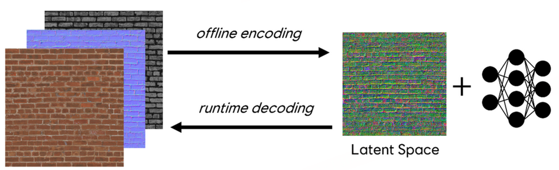
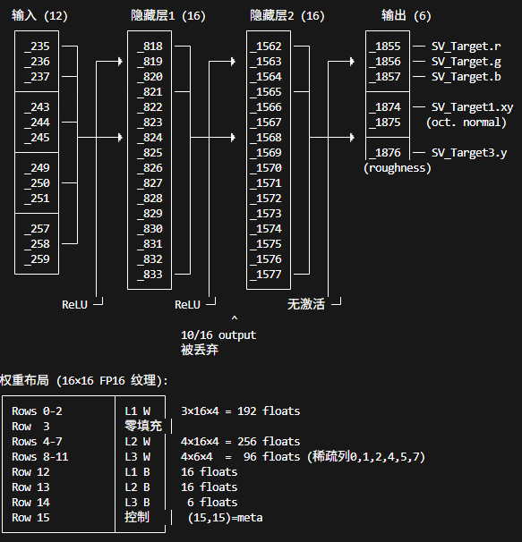

# Neural Texture Compress技术报告

## 前言
一组神经纹理 + 较小的MLP。
 即纹理采样用从Neural Texture采样+小mlp解压的方法。这个work的原因是PBR纹理一般都含有相似的结构，因此可以利用这一点压缩成一张纹理（这张纹理成为Neural Texture/ Feature Texture/ Feature Grid）+ 理解颜色的MLP。假如我们需要烘焙24张lightmap/probe（代表24小时），这24张纹理在**结构上都是一致的**，只是因为时间点不同而映射出不同的颜色，完全也可以用此方法 来做压缩。

具体怎么用呢，按NV的说法，根据推理的时间有所不同：
- Inference on Sample，采样时计算，这样必须要求小网络
- Inference on Load，加载时计算，这样网络可以适当大点
- Inference on Feedback，利用dx12的sampler feedback功能

各家的路线大差不差，都是基于NV的论文和育碧的论文做了一些小修小补。主要的差别是神经纹理本身的格式和参数（纹理大小、MLP）、网络的入参（uv; uv + feature; ...）。单张纹理训练代价也不是很大。

先看效果和性能：
## 效果

## 性能

## Ubisoft[1]:
1. 格式：神经纹理本身经过BC1压缩和QAT；
2. 参数：
   1. 4个神经纹理，大小为均/2，例如最高是1024，则次高是512
   2. 两层MLP，12->16->16->6
   3. 网络入参就是4个纹理采样的结果，

### 落地版本

【实机适用范围】树、桌子、窗框、木板

尺寸：与原纹理有关，两张和原纹理尺寸相同，两张为原纹理尺寸的1/4。

| | 纹理 | 格式 | 尺寸 |
|---|---|---|---|
| NTC | 2× 512×1024 特征 | BC1 | 512 KB |
| | 2× 256×512 特征 | BC1 | 128 KB |
| | 权重表 16×16 | FP16×4 | 2 KB |
| | **合计** | | **642 KB** |
| fallback | albedo RGB | BC1rgb | 256 KB |
| | normal  roughness  | BC7 | 512 KB |
| | **合计** | | **768 KB** |

| 尺寸 | NTC (KB) | Fallback (KB) | 节省 |
|---|---|---|---|
| 512×1024 | 642 | 768 | 16.4% |
| 1024×1024 | 1,282 | 1,536 | 16.5% |
| 512×2048 | 1,282 | 1,536 | 16.5% |

输出：输出是6（AO*1, Noraml * 2, Diff * 3）。金属度和粗糙度**不经过网络**。他们宣称节省了30%，不知道是咋算的。。我感觉参数有点冗余。

MLP用一个纹理保存（16*16），其中最后一位保存是否开启。MLP的结构是：

## Intel[4]:
本身是ubisoft早期工作的一个改进，加了bc1、QAT,主要是coorpertive matrix，据称在网络宽度较大（>32）时能得到巨量提升。

## NVIDIA[2]:
hardGELU近似GELU；

做了很多模拟量化。

参数：两个金字塔
## AMD[3]:
一个endpoint网络，一个color网络，预测未压缩颜色 

feature texture：FP16，额外多10%做8bit QAT；

3 个隐藏层，每层 64 neurons，SELU 激活，输出 sigmoid（太大了！）

推理后获得BC结果（加载阶段）
## 腾讯[5]:
主要是优化NTC让其能在手机上跑。
技巧：
1. 移动端不用位置编码
2. hard-Swish激活函数，hardSwish(x) = x * saturate(x * (1.0f / 6.0f) + 0.5f)
3. 没有做QAT，训练完了直接量化成ASTC等等，据称没有差异。
4. 网络: 两个rgba8,16 bit + 位置编码等等，一共33->16->channels

结果：据称8gen1全屏NTC材质GPU额外耗时约 0.5ms 以内，视觉上没有较大差异
 

## 腾讯[6]:
Compression后应该做QAT，以解决压缩目标（重建参数图）和解压目标（重建原图）不一致的问题（压缩的好不等于用压缩参数复原的好）。但是对于有分区选择的压缩算法（如BC6），分区后相当于原本参数空间的子空间，不一定能复原的好。

这篇文章试图选择最优分区，方法比较复杂，主要思路就是对于
每种partition都记录一个评分，不断更新评分，并选择几个评分高的训练。因此这对于ASTC几千个分区模式的不太现实。

## Ours：
先用float32训，然后QAT，然后MLP的QAT

PC端：
BC1压缩

手机端：
ASTC压缩

## 实现：

# 参考文献：
[1] https://www.ubisoft.com/en-us/news/ignt.58488/shipping-neural-texture-compression-in-assassin-s-creed-mirage
[2]  https://github.com/NVIDIA-RTX/RTXNTC
[3] https://gpuopen.com/download/2024_NeuralTextureBCCompression.pdf
[4] https://arxiv.org/abs/2506.06040 
[5] https://www.cnblogs.com/KillerAery/p/19284313#%E6%80%A7%E8%83%BD%E6%95%B0%E6%8D%AE
[6] https://github.com/Ubpa/DBC; https://diglib.eg.org/items/9dfee807-eeec-485a-82a6-f466268d28c2